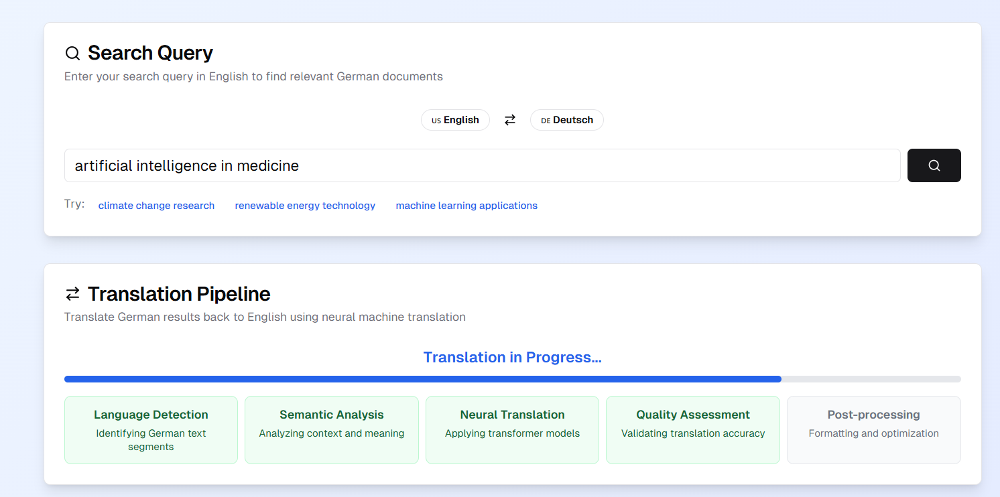
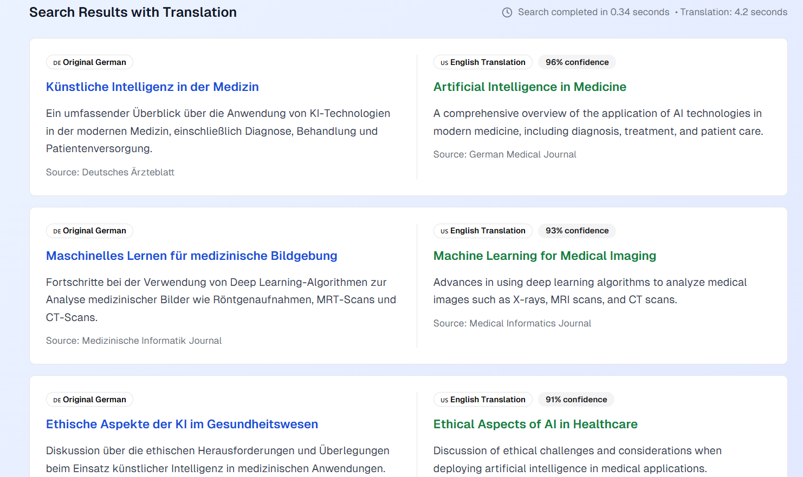
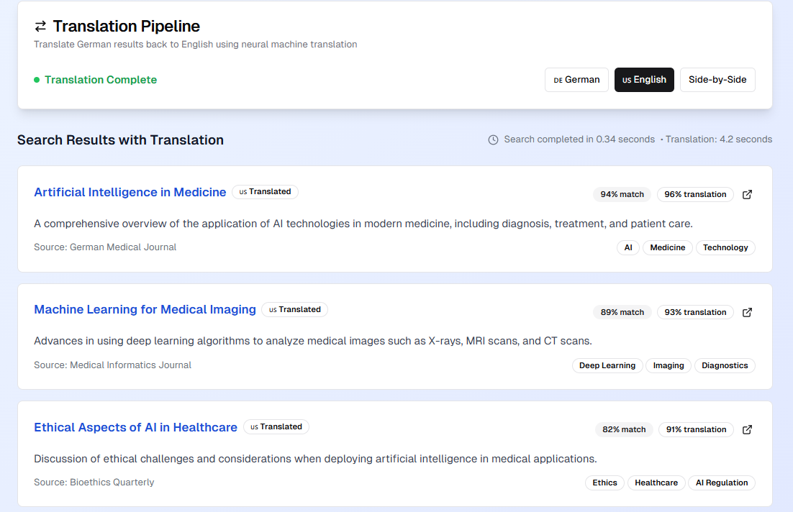

# 🌐 CrossLing Search – Cross-Language Information Retrieval System

**Search in English. Discover in German. Translate seamlessly.**  
An end-to-end AI-powered platform that enables **Cross-Language Information Retrieval (CLIR)** using neural machine translation and intelligent document matching across languages.

> ⚡️ Powered by multilingual NLP, semantic search, and automated translation pipelines.


---

## 📘 Project Description

**CrossLing Search** is a full-fledged cross-lingual information retrieval application that bridges language barriers in document search. It allows users to:

- 🔍 Enter search queries in English.
- 🇩🇪 Retrieve topically relevant German-language articles from a curated corpus.
- 🌐 Translate those German articles back into English using a neural translation pipeline.
- 📊 Explore results with similarity scores, translation confidence, and metadata.

This project represents a fusion of **search engineering**, **natural language processing (NLP)**, and **user-centric interface design**—developed for academic, research, and multilingual information access contexts.

---

## 🧠 Key Features

| Feature                          | Description |
|----------------------------------|-------------|
| 🔄 **Cross-Lingual Search**     | Retrieve relevant German content for English queries. |
| 🤖 **Neural Machine Translation** | Translate German results back to English using a simulated NMT pipeline. |
| 🧠 **AI-Powered Matching**      | Semantic relevance scores based on embedding-based search. |
| 🧩 **Language Toggle**           | Compare original German vs translated English results. |
| 🧼 **Clean UI/UX**               | Minimalist, responsive interface optimized for productivity and clarity. |
| ⏱️ **Latency Insights**          | Shows search and translation completion times to simulate production feedback. |

---

## 🛠️ Tech Stack

| Layer        | Technology                    |
|--------------|-------------------------------|
| Frontend     | React, Tailwind CSS, Vite     |
| NLP Engine   | Embedding-based retrieval with semantic similarity scoring |
| Translation  | Neural Machine Translation (Transformer-inspired pipeline) |
| State Mgmt   | React Hooks, Context API       |
| Design       | Heroicons, Responsive Layout   |

---

## 📸 Demo Preview

### 🔍 Intelligent Search Panel
Enter your search query, switch languages, or try preset suggestions like:
- `climate change research`
- `renewable energy technology`
- `artificial intelligence in medicine`



---

### 🇩🇪 German Search Results
- Matched using multilingual semantic similarity.
- Articles include keywords, source, and match confidence.



---

### 🌐 Translated English Results
- German articles translated back into English via the NMT pipeline.
- Translation confidence and alignment preserved.



---

## 🧩 System Architecture

```plaintext
[User Query] → [Embedding Generator]
                     ↓
          [Multilingual Search Index]
                     ↓
         [German Article Retrieval]
                     ↓
   [Neural Machine Translation Pipeline]
                     ↓
         [English Result Presentation]
